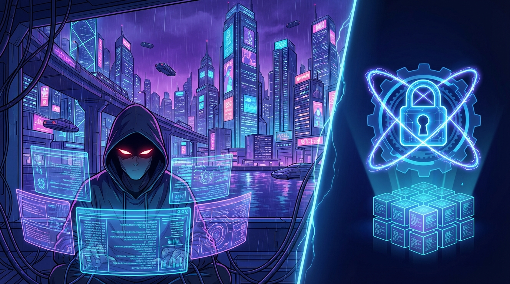
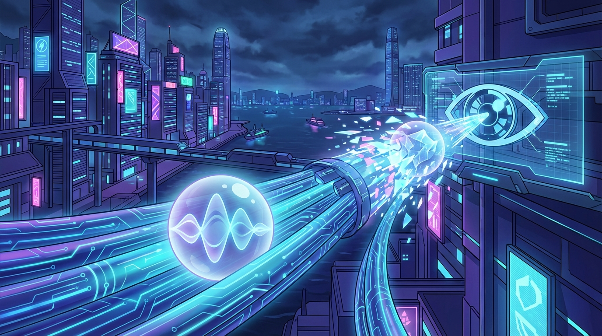
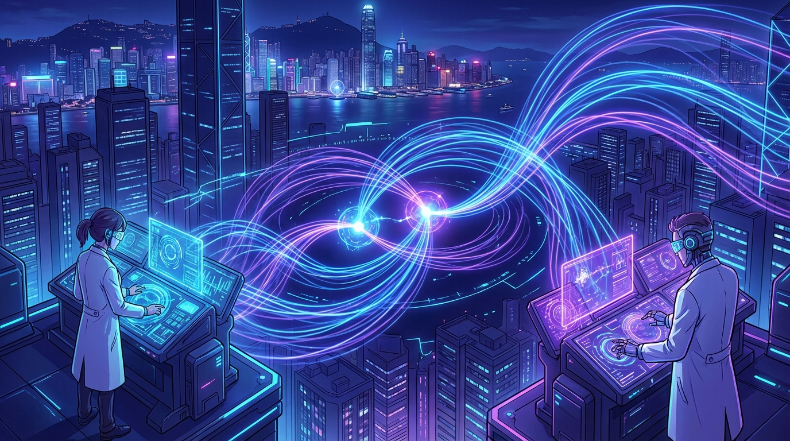
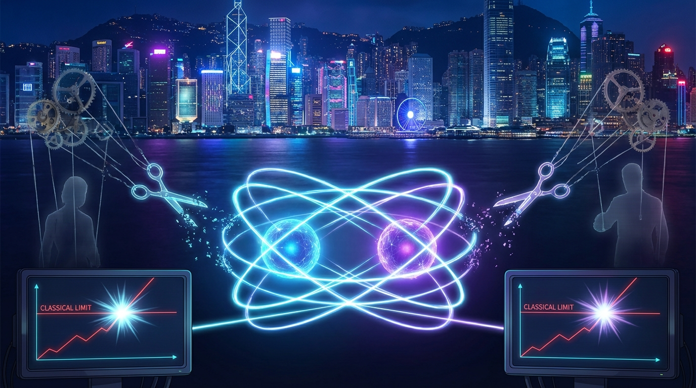
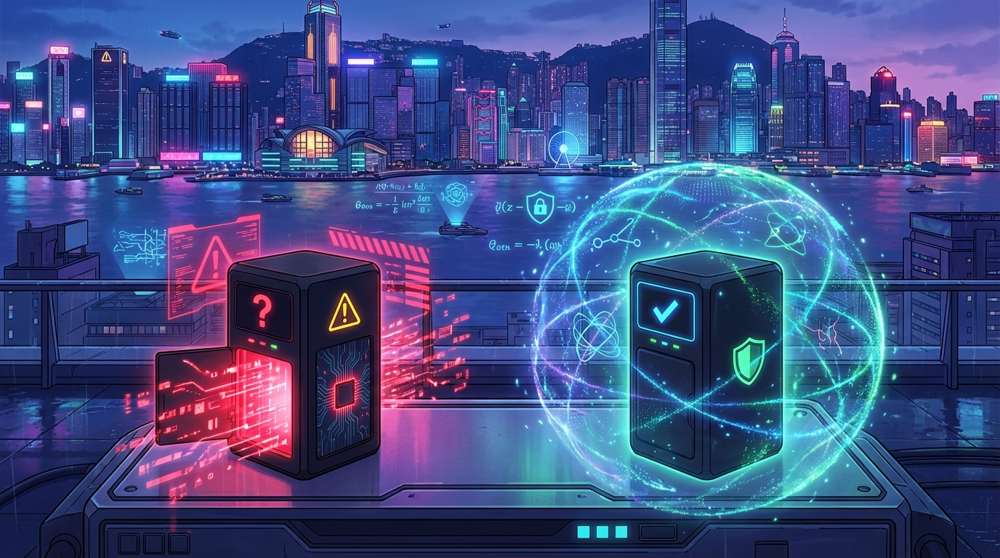
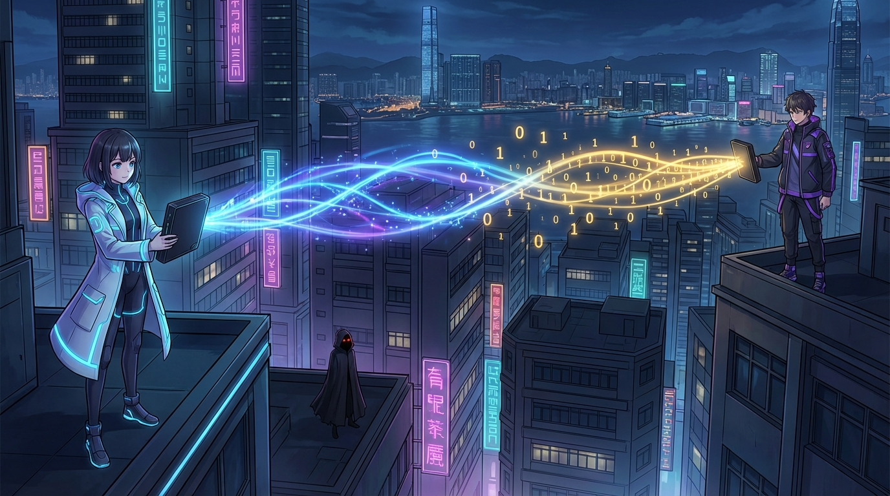
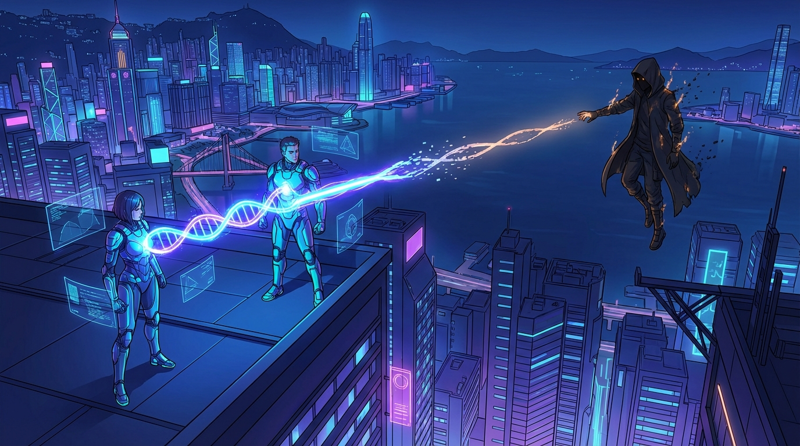

<!-- _class: title -->

# Device Independent QKD

## The Ultimate Secure Communication

### Hong Kong 2025

---

## Why Secure Communication?

- **Banking** - Your money, your secrets
- **Messaging** - Private conversations
- **Government** - National security
- **Business** - Trade secrets

The problem: **Eavesdroppers are everywhere**

---

## The Classical Crypto Problem

Current encryption (RSA, AES) relies on **computational hardness**

- Hard to factor large numbers... *for now*
- **Quantum computers** will break RSA
- We need security based on **physics**, not math

---

## Quantum Key Distribution

**Key insight**: Measuring quantum states *disturbs* them

- Send information encoded in quantum states
- Any eavesdropper leaves traces
- Detect intrusion *before* it's too late

But there's a catch...

---

<!-- _class: title -->

# Entanglement

## "Spooky Action at a Distance" — Einstein

---

## Quantum Entanglement

Two particles, **perfectly correlated**

- Measure one → instantly know the other
- Works across *any* distance
- Cannot be explained classically

Alice and Bob share entangled pairs across Hong Kong harbour

---

## The Bell Inequality

Can correlations be explained by **hidden variables**?

John Bell (1964): Test it!

**CHSH inequality**:
`S ≤ 2` for any classical theory

Quantum mechanics predicts: `S ≤ 2√2 ≈ 2.83`

---

## What Bell Violation Means

If `S > 2`:
- **No pre-determined strategy** could produce these results
- Correlations are *genuinely quantum*
- No hidden "puppet strings"

This is our **security foundation**

---

## The Device Independence Insight

**Standard QKD problem**: Must trust your devices

- What if manufacturer has backdoor?
- What if hardware is compromised?
- What if Eve built your detector?

**DI-QKD solution**: Trust the *physics*, not the device

---

---

## How DI-QKD Works

1. Alice & Bob receive entangled photons
2. Perform **Bell test** on samples
3. If `S > 2` → Quantum correlations confirmed
4. Extract **secret key** from outcomes
5. Eve *cannot* fake Bell violation

**Security from physics alone**

---

## Security Guarantee

**Monogamous correlations**:

If Alice-Bob are maximally entangled...
→ Eve gets **nothing**

- Quantum correlations cannot be shared
- Maximum correlation = Maximum security
- Mathematical proof, not assumption

---

## Current Challenges

- **Loophole-free** Bell tests required
- Need **high-efficiency** detectors (>80%)
- **Distance limitations** (current: ~400m)

**Future**:
- Satellite-based DI-QKD
- Quantum repeaters
- City-wide networks

---

---

## The Quantum Future

**DI-QKD** offers:
- Security based on *laws of physics*
- No need to trust devices
- Protection against *any* eavesdropper

Hong Kong: Ready to become a **quantum communication hub**?

---

<!-- _class: title -->

# Thank You!

## Questions?

### 多謝！有問題嗎？
